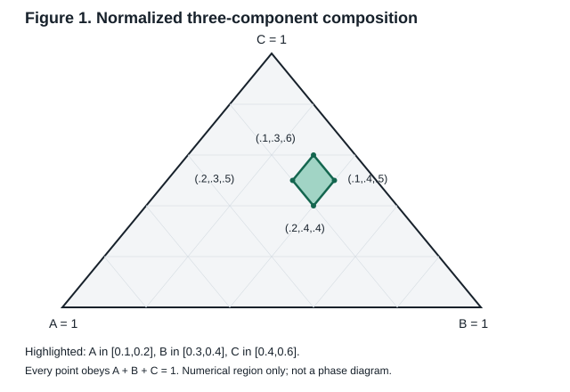
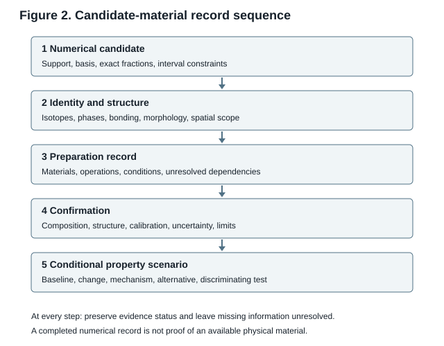

# Provisional materials disclosure with attributed oxide and defect evidence - 30 September 2026

Prepared **30 September 2026** | **Prospective unfiled oxide-defect-evidence edition** for applicant and patent counsel.

This edition derives from the preserved [electrical-evidence source](provisional_application_electrical_evidence_2026-09-30.md), SHA-256 `36125cd499bd20cd64bdad9ca599d65f2e637fc2a130a552471f9c83c7f3284a`, at repository baseline `6d25542eb72f46ab148f6bad9ab81a2aaccdfe9a`. It develops [0064] with source-specific rutile preparation, diagnostic/assay boundaries, ideal-host accounting and a conditional verification scenario. Claims 1-199 and their assessment statuses are unchanged; nine earlier PDFs and their sources remain historical artifacts. The [edition change record](application_oxide_defect_evidence_2026-09-30.md) records decisions and checks.

This prospective description is neither a filed application nor a certification of physical enablement, inventorship, priority, patentability or universal exclusion of later materials patents.

## 1 Technical field

[0001] The subject matter concerns the description, preparation, characterization, and comparison of materials having specified elemental and isotopic compositions, structures, processing histories, and properties. Materials considered include metals and alloys, inorganic compounds and ceramics, molecular substances, polymers, composites, mixtures, and single-element forms. Particle-containing or excited systems are addressed separately from ordinary chemical constituents.

[0002] A composition framework is provided to identify selected constituents, normalize their proportions, express exact values and intervals, and associate each numerical description with a structural and preparation record. Its purpose is to make the requested scope explicit and reproducible as a specification of candidate compositions. Whether an individual candidate exists, can be synthesized, or has a useful property requires additional technical information.

## 2 Background and evidence status

[0003] An elemental formula does not uniquely define a material. Connectivity, crystal structure, phase assemblage, isotope distribution, defects, interfaces, orientation, morphology, and processing can distinguish systems sharing the same elemental proportions. A molecular formula can describe different isomers; a ceramic formula can describe different polymorphs; a polymer formula can omit sequence and architecture; a composite's overall percentages can omit its load-bearing or conducting network.

[0004] The element vocabulary has two groups. The recognized group consists of atomic numbers 1 through 118 in the IUPAC periodic table. The requested extension consists of unconfirmed placeholders with atomic numbers 119 through 138. The extension is an indexing convention for hypothetical candidates, not a statement that these elements have been discovered or possess known chemistry. [IUPAC periodic table](https://iupac.org/what-we-do/periodic-table-of-elements/)

[0005] Four evidence labels are used locally: ESTABLISHED for an attributed source teaching; CALCULATED for a stated mathematical result or model calculation; PROPOSED for an unperformed preparation or test with specified assumptions; and UNSUPPORTED for a possibility without adequate preparation or property support. These labels do not decide patentability. A calculated fraction is not a measured composition, and a proposed recipe is not a performed experiment.

[0006] No new synthesis, measured yield, verified phase, measured property, or applicant-specific successful embodiment is reported in this draft. Published third-party examples retain their attribution. The requested breadth includes unsupported candidates. These candidates are expressly identified so that the scope is visible without representing them as established teachings.

## 3 Summary of the composition framework

[0007] A candidate material is described by a record R = (B, S, x, I, U, C, P, M, F, E), where B is the composition basis; S is the constituent support set; x is the normalized composition vector; I is the isotope and nuclear-state description; U is the structural and spatial description; C is the preparation and conditioning record; P is the property scenario; M is the measurement record; F identifies failure boundaries; and E identifies evidence and sources. Missing fields are stated explicitly.

[0008] The framework includes every nonempty subset of the 118 recognized element labels and, separately, every nonempty subset of the 138-label vocabulary including the hypothetical extension. It includes every positive normalized continuous composition as a target description and every rational normalized composition as a separate exact accounting description on the expressly selected basis. A rational atomic-fraction vector is compatible with integer atom counts when the chosen atom inventory N satisfies its primitive-denominator condition; a rational mass-fraction vector does not by itself establish that atom-count condition. A finite decimal grid is a useful additional subset, not a replacement for either domain.

[0009] Each interval embodiment is the intersection of its component bounds with the normalization condition. Component endpoints cannot be selected independently if their sum would differ from one. Numerical enumeration provides a reproducible address for a candidate; it supplies neither missing chemistry nor a proof that later claims to that candidate lack novelty.

## 4 Composition bases and constituent accounting

[0010] On an atomic basis, let a_i = N_i / sum(N_j), where N_i counts atoms of element i in the specified inventory, and set the generic record fraction x_i = a_i. A mole-of-atoms basis has the same normalized proportions when the same atom inventory is used. A mole-of-molecules, formula-unit, repeat-unit, site-occupancy, or feed-component basis is different and must be expressly named. Denominators must identify the counted entity, sample region, and inclusion of impurities.

[0011] On a mass basis, let w_i = m_i / sum(m_j) and set the generic record fraction x_i = w_i. Conversion from elemental atomic fractions uses w_i = a_i M_i / sum_j(a_j M_j), with positive finite isotope-qualified effective masses M_i under the same expressly stated mass-allocation and compatible-unit convention described in [0047]. The inverse uses a_i = (w_i/M_i) / sum_j(w_j/M_j). Standard atomic weights are not substitutes for unknown masses of hypothetical nuclei or other populated states. Conversion is unavailable where the needed mass information is unavailable. The generic x_i is not treated as atomic on a record expressly using mass fractions.

[0012] Volume fractions describe identified phases or constituents under specified temperature, pressure, density, and volume-assignment conventions. They are not automatically elemental atomic fractions. Mixing volumes need not be additive. A composite record therefore identifies constituent densities and whether volume fractions are measured, calculated from a justified additive model, or nominal feed values.

[0013] Feed proportions, retained product composition, and local measured composition are separate fields. A specimen may contain gradients, layers, inclusions, or surface enrichment. The support set identifies which constituents have positive fractions in the stated denominator. Zero entries are omitted from the canonical support set, while a zero concentration endpoint can describe a boundary shared with a smaller support set.

[0014] A closed composition specification includes all constituents in its denominator. An open specification can permit additional constituents, but must state how their inclusion affects normalization. A record describing selected constituents relative only to their subtotal is not a complete bulk-composition assay. Residual impurities are included as identified amounts, bounded unknown residuals, or an expressly unresolved term; they are not silently set to zero.

## 5 Exact constituent support and composition domains

[0015] Let E = {E_1, ..., E_118}, with E_Z corresponding to the recognized element of atomic number Z. Let H = {E_119, ..., E_138} denote the hypothetical placeholders. For either vocabulary V, choose an ordered support S = (E_z1, ..., E_zk), with strictly increasing atomic numbers. The ordering removes duplicate permutations; it does not restrict spatial ordering within a material.

[0016] For each integer k from 1 through the vocabulary size, the continuous target domain is Delta(S) = {x : x_i > 0 for every member of S, sum(x_i) = 1}. Its closure permits x_i = 0, with the resulting candidate reassigned to its positive support. Every value is dimensionless; percent values equal 100 x_i. For k = 1, the only normalized vector is (1).

[0017] The rational domain consists of all x_i = n_i/q, where q is any positive integer, each n_i is a positive integer, and sum(n_i) = q. For k constituents, q must be at least k. A primitive representation has gcd(q, n_1, ..., n_k) = 1. This removes duplicate representations such as (1/2, 1/2) and (2/4, 2/4). The unrestricted denominator includes (1/3, 2/3), which is absent from a grid whose denominator is 10^19.

[0018] The requested decimal composition grid has accounting denominator D = 10^19. Its vectors satisfy x_i = n_i/D, n_i >= 1, and sum(n_i) = D on the selected composition basis. The integers n_i are grid numerators; D does not automatically equal the specimen's atom count N, particularly on a mass basis. Atomic count compatibility is evaluated using the atomic vector and the chosen N. The smallest positive grid fraction is a = 1/10^19 = 0.0000000000000000001. In percent units it is 0.00000000000000001%. This is a chosen grid increment, not a universal physical concentration limit.

[0019] For k positive constituents on this grid, no single constituent can exceed 1 - (k-1)/D. A two-component extreme is (1/D, (D-1)/D). A 138-component extreme has 137 constituents each at 1/D and the remaining constituent at (D-137)/D. These vectors normalize exactly. They do not establish that a chemically homogeneous or stable 138-element material can be made.

[0020] The broad continuous and unrestricted rational domains remain available below the selected grid floor. If a particular embodiment imposes a positive floor a, then k a <= 1 is necessary and sufficient for an unconstrained normalized vector to exist. For a fixed total atom inventory N, the least positive atomic count fraction is 1/N. Since N depends on the sample, no sample-independent lower fraction follows from atom counting.

[0021] The SI Avogadro constant is exactly 6.02214076 x 10^23 per mole. An inventory of 10^19 atoms is approximately 0.00001660539067 mole of atoms. One specified atom among that inventory gives a count fraction of 10^-19. The arithmetic does not establish controlled placement, detectability, representative sampling, or a reproducible bulk property. [BIPM definition of the mole](https://www.bipm.org/en/si-base-units/mole)

[0022] The recognized vocabulary has 2^118 - 1 nonempty supports. Its supports of size at least two number 2^118 - 1 - 118. The extended vocabulary has 2^138 - 1 nonempty supports and 2^138 - 1 - 138 supports of size at least two. For a fixed selected support of size k on the D grid, the number of positive vectors is binomial(D-1, k-1). These are counts of mathematical descriptions, not counts of enabled substances.

## 6 All endpoint ranges and complementary proportions

[0023] For each precision index p = 0, 1, ..., 19, let Q_p = 10^p. Select integers l and u with 0 <= l <= u <= Q_p. The closed interval I(p,l,u) = [l/Q_p, u/Q_p] defines every pair of decimal-grid endpoints at that precision, including exact-point intervals l = u. Percent endpoints are [100 l/Q_p, 100 u/Q_p]. Every elementary cell [j/Q_p, (j+1)/Q_p] is included for 0 <= j < Q_p, as is every union represented by a contiguous pair of endpoints.

[0024] At p = 2 the elementary cells are [0%,1%], [1%,2%], ..., [99%,100%]. For a binary composition, if x_A lies in [L,U], x_B = 1 - x_A lies in [1-U,1-L]. Thus [1%,2%] pairs with [98%,99%], [2%,3%] with [97%,98%], and [49%,50%] with [50%,51%]. Corresponding endpoints describe correlated compositions: (1%,99%) and (2%,98%), not (1%,98%).

[0025] Closed cells share their endpoints. This intentional overlap avoids losing boundary values. Canonical indexing may assign a shared boundary to one cell for retrieval, but the physical composition is unchanged. Exact boundary points, every intermediate target value, each contiguous subrange with specified endpoints, and each complement are contemplated as numerical descriptions. This language does not assert that all such subranges are legally disclosed with sufficient specificity.

[0026] The requested interval 0.0000000000000001% through 0.000000000000001% equals [10^-18,10^-17] as a fraction. On the D grid its numerators are 10 through 100 inclusive: 91 exact grid values and 90 elementary bins. The binary complement is [(D-100)/D,(D-10)/D], or [99.999999999999999%,99.9999999999999999%]. Fraction and percent units must not be interchanged.

[0027] The 50/50 binary vector is exactly (1/2,1/2). The entire decimal hierarchy connects ordinary percent cells to the requested very small cells. Additional rational intervals [r,s], for all rational 0 <= r <= s <= 1, and real endpoint target intervals may be specified outside the decimal hierarchy. Real targets, rational finite-count descriptions, decimal grid values, and measured tolerances remain distinct.

[0028] A decade refinement supplies optional addresses for very small positive values. For e from -19 through -1 and any nonnegative integer r, define intervals [j x 10^(e-r), (j+1) x 10^(e-r)] with j = 10^r, ..., 10^(r+1)-1. These partition each selected decade at the specified refinement, with shared closed boundaries. Refinement beyond the D grid is symbolic or rational coverage, not an assertion of greater attainable manufacturing precision.

[0029] For a selected k-component support choose an interval [L_i,U_i] for every component, with 0 <= L_i <= U_i <= 1, after intersecting any supplied bounds with [0,1]. The candidate domain is {x : L_i <= x_i <= U_i, sum(x_i) = 1}, intersected with the applicable positivity or grid conditions. A box with closed component bounds is feasible on the nonnegative continuous simplex exactly when each L_i <= U_i and sum(L_i) <= 1 <= sum(U_i). This test is applied after intersecting with any selected positive floor and corresponding upper bound.

[0030] A preliminary nonnegative normalized witness z can be constructed exactly for a box satisfying the ordinary conditions of [0029]: start with z_i = L_i; let residual r = 1 - sum(L_i); in support order add min(r, U_i-L_i) to each component and reduce r accordingly until sum(z_i) = 1. With rational inputs the calculation uses exact fractions. Assign this preliminary witness as a positive target only when every coordinate is positive. Otherwise a separate strictly positive witness within the same bounds is required before assigning a positive target for that selected support. A greedy witness containing zero does not prove that another positive witness is unavailable. Under the ordinary feasibility conditions, positive feasibility requires every U_i > 0. If S = sum(L_i) = 1, the lower-bound vector is the only feasible vector, and every L_i must be positive. If S < 1, choose epsilon = min(min_i U_i, (1-S)/(2k)), replace each lower bound by L'_i = max(L_i,epsilon), and allocate residual 1-sum(L'_i) within the unchanged upper bounds. Epsilon is positive, each raised lower bound remains within its upper bound, and sum(L'_i) <= S + k epsilon <= (1+S)/2 < 1; sum(U_i) >= 1 supplies the remaining capacity. The result is a strictly positive normalized witness within the original box. This local epsilon is not a global concentration floor or a domain-wide denominator cap. With rational inputs all operations remain exact. Removing zero coordinates describes a separate smaller-support candidate with its own support and bounds, rather than completion of the original positive-support request.

[0031] For the D grid, set b_i = max(1,ceiling(D L_i)) and c_i = min(D-k+1,floor(D U_i)), and test b_i <= c_i for every component and sum(b_i) <= D <= sum(c_i). Every positive integer vector summing to D has n_i <= D-k+1, so the cap excludes no such vector. On acceptance, start with integer n_i = b_i and allocate residual D-sum(b_i) within the upper integer bounds until sum(n_i) = D, then assign x_i = n_i/D as the positive normalized target on the selected basis. The inequalities are necessary and this allocation supplies sufficiency. D is a composition accounting denominator, not automatically an atom inventory N. A box may be continuously feasible and contain no D-grid vector. For example the exact binary vector (1/3,2/3) is rationally feasible but is not on the D = 10^19 grid. Rejection on that grid does not reject the wider rational or real target domain.

[0032] Independent selection of all endpoint ranges is permitted as an indexing operation. Requests failing ordinary feasibility, strictly positive feasibility for the selected support, or a selected grid are recorded as rejected numerical requests with the particular reason. Rejection alone does not complete positive-target assignment or the remaining record operations of claim 186. A box admitting only a zero-containing vector cannot supply that selected positive support. Example: three lower bounds of 40% cannot normalize. A valid ternary example has atomic intervals A = [10%,20%], B = [30%,40%], C = [40%,60%], with positive target (10%,30%,60%). No product phase or preparation follows from that witness.

## 7 Structural and spatial descriptions

[0033] A material record identifies whether the composition describes a single phase, multiple phases, a molecular species, a solution, a dispersed mixture, a layered article, or an ensemble. Where the distinction is unknown, it is marked unknown. A numerical vector does not imply every constituent occupies a common lattice or remains uniformly distributed.

[0034] For a crystalline candidate, specify the phase identity, space group or structural model where known, lattice parameters with conditions, occupied sites, substitutions, vacancy rules, ordering, and charge-balance constraints. A proposed site assignment is labeled PROPOSED. Unknown structure is not filled by saying all crystal structures are present.

[0035] For an amorphous candidate, identify the preparation history, detectable crystalline fraction, relevant local-order evidence, glass transition or relaxation behavior where measured, and the test's resolution. For molecular candidates identify connectivity, stereochemistry, salt/solvate and hydration state, and purity. Distinct connectivity is separately indexed even if elemental fractions match.

[0036] For polymers specify repeat units, incorporated comonomer ratios, sequence distribution, tacticity, molecular-weight distribution, branching, end groups, crosslink topology, additives, and conditioning. Feed composition alone does not establish incorporated composition. For composites specify constituent identities, dimensions, orientation, interfaces, dispersion, layer order, void fraction, and the basis of each fraction.

[0037] Spatial variations can be represented by a composition field x_i(r,t) with a defined coordinate region and sampling or averaging convention. A whole-specimen fraction is an integral over the appropriate count or mass density, not a simple average of unequal regions. Gradient, core-shell, layered, patterned, and porous descriptions require their dimensions and fabrication information. None is assumed to arise from every overall vector.

## 8 Preparation and confirmation records

[0038] Each preparation record states starting substances, grades, quantities, apparatus, order of operations, temperature, pressure, atmosphere, time, cooling or curing history, isolation, purification, post-treatment, scale, and relevant storage. Distinguish actual parameters from suggested values. A route class such as melting or deposition is insufficient as the preparation instruction for an unfamiliar composition.

[0039] Metals and alloys may be investigated through documented melting, powder consolidation, electrodeposition, or vapor deposition, followed by specified thermal and mechanical treatment. The selected route must address volatilization, immiscibility, reaction, contamination, competing phases, and phase stability for the actual constituents. This is a route-selection framework, not an assertion that one process works for every support.

[0040] Inorganic and ceramic candidates may use documented solid-state, solution, hydrothermal, solvothermal, deposition, or precursor-conversion routes. The actual precursors, stoichiometry, atmosphere, thermal schedule, isolation and phase-confirmation steps are necessary. Molecular candidates require a defined reaction or assembly and purification. Polymers require a defined polymerization, incorporated composition and forming history. Composites require constituent preparation, mixing or assembly, consolidation, and interface controls.

[0041] An unperformed recipe is a PROPOSED example stated prospectively. It reports no fabricated yield, measurement, or success. If a step depends on discovering an unavailable precursor, synthesizing a hypothetical element, stabilizing an unobserved nucleus, or establishing an unknown reaction, that dependency is an unresolved research problem rather than routine implementation.

[0042] Confirmation is selected to distinguish the target from realistic alternatives. Composition analysis alone may not identify a polymorph; diffraction alone may not detect a trace constituent; nominal instrument resolution is not a validated limit of detection in the actual matrix. Record calibration, reference materials, uncertainty, sampling, specimen history, and the method's detection and quantification limits. A nondetection is not proof of absence. [IUPAC limit of detection](https://goldbook.iupac.org/terms/view/L03540)

[0043] A tiny exact fraction is a mathematical target until preparation and measurement support a physical assertion. Experimental tolerance is specified separately, for example an interval or uncertainty with confidence convention. No instrument is claimed here to distinguish compositions separated by 10^-19 fraction. At trace levels, isotope signatures, contamination control, adsorption, sampling statistics, and atom-count discreteness can dominate the interpretation.

[0044] An established teaching for comparison is TiO2(B) nanosheets reported by Xiang and colleagues in 2013. Their nominal formula has Ti:O = 1:2; the B phase, nanosheet morphology, and exposed surface are additional features. Their paper reports a solvothermal preparation from titanium tetrachloride, water, and ethylene glycol, at 150 degrees C for six hours, with isolation and washing and diffraction/microscopy characterization. This is an attributed source summary; the complete methods remain necessary, and no applicant repetition is claimed. [Xiang et al., Scientific Reports 3, 1411](https://www.nature.com/articles/srep01411)

[0045] The TiO2 formula corresponds to rational atomic fractions (1/3,2/3). Its inclusion demonstrates why the unrestricted rational domain is needed and why a decimal grid alone is incomplete. It does not establish exact product purity, all titanium oxide polymorphs, every Ti/O ratio, or every process and use. Reproducing old literature is not represented as creating a newly available teaching.

## 9 Isotopes and nuclear states

[0046] An isotope-resolved constituent is identified by atomic number Z, mass number A, neutron count N = A-Z, and nuclear-state designation. For the elemental vocabulary, Z is 1 through 118 or an explicitly hypothetical 119 through 138. A is an integer at least Z. This parameterization includes candidate identifiers beyond observed nuclides; it does not assert that every (Z,A) nucleus is bound, observable, stable, or preparable.

[0047] For each element i, let y_i,a,s be the conditional atom-count fraction of its atoms assigned to isotope a and nuclear state s in the specified inventory, with y_i,a,s >= 0 and sum_a,s(y_i,a,s) = 1. This conditional distribution remains atom-count based regardless of the composition basis selected for the material. Let a_i denote the elemental atomic fraction and w_i the elemental mass fraction; x_i of the selected composition record equals a_i on an atomic basis or w_i on a mass basis. The whole-inventory atomic fraction of a nuclide-state entry is a_i y_i,a,s. Where mass conversion is supported, specify qualified masses mu_i,a,s per counted atom under a consistent, expressly stated mass-allocation convention, including the relevant isotope, nuclear/electronic state and any precision-dependent binding or allocation qualification. Define M_i = sum_{a,s : y_i,a,s > 0}(y_i,a,s mu_i,a,s), with positive finite M_i, summing only over populated entries. For each such entry define the derived conditional mass fraction r_i,a,s = y_i,a,s mu_i,a,s/M_i. The whole-inventory nuclide-state mass fraction is w_i r_i,a,s. Entries with y_i,a,s = 0 have r_i,a,s = 0 without requiring a mass value for an unpopulated entry. Each element's nuclide-state atomic fractions sum to a_i and its nuclide-state mass fractions sum to w_i. Elemental conversions use w_i = a_i M_i/sum_j(a_j M_j) and a_i = (w_i/M_i)/sum_j(w_j/M_j) under the same convention. Unknown masses for positively populated entries prevent numerical mass conversion; they are not supplied by standard atomic weights, placeholders, blanks or assumed zeros. An atomic target and its conditional atom-count distribution can still be described without asserting an unavailable mass conversion. Natural, enriched, depleted, pure-isotope and mixed-isotope targets can be recorded. These equations are compositional accounting, not proof of state existence, availability, preparation, persistence or measured fractions; lifetime, decay products, observation time and preparation history remain separate requirements.

[0048] Ground states, isomers, resonances, and evaluated excited levels are not collapsed into one identifier. NUBASE2020 and AME2020 provide dated evaluation resources for nuclear states and atomic masses. Their measured, estimated, and unobserved entries must retain those distinctions. The 2020 edition's experimental cutoff is not a statement that it contains every nuclide known in September 2026. [NUBASE2020](https://www-nds.iaea.org/amdc/ame2020/NUBASE2020.pdf), [AME2020 Part I](https://doi.org/10.1088/1674-1137/abddb0), [AME2020 Part II](https://doi.org/10.1088/1674-1137/abddaf)

[0049] An archival isotope record retains the source edition, nuclide identifier, state, existence-status evidence, property-estimation markers, units, uncertainties, half-life, decay modes, and retrieval date. A systematics marker on a mass is not by itself an existence-status classification. LiveChart API records likewise require their evaluation provenance; its guide identifies the underlying snapshots. No complete current nuclide export is represented as included in this draft. [IAEA LiveChart API guide](https://www-nds.iaea.org/relnsd/vcharthtml/api_v0_guide.html)

[0050] A changing radioactive inventory is a function of time and preparation history. Its composition vector is identified at a specified time or over a stated averaging period. Daughter products enter the support when included in the denominator. A short-lived nuclear species is not assumed to persist through an ordinary bulk preparation or measurement.

## 10 Subatomic and emergent particle systems

[0051] Established elementary-particle categories are distinguished from composite particles, nuclei, material excitations, and hypothetical particles. The Standard Model register includes six quark flavors, six lepton flavors, gauge bosons, and the Higgs boson, with antiparticle and charge-state conventions where applicable. A category listing does not teach arbitrary stable macroscopic mixtures of those particles. [CERN Standard Model](https://home.web.cern.ch/science/physics/standard-model/)

[0052] A particle-system record identifies species and experimental status, quantum numbers, charge, mass where established, energy/momentum distribution, population or occupation convention, confinement or host, temperature or non-equilibrium state, lifetime, interaction model, preparation, and observation. Quarks within a nucleus, that nucleus, and the atom containing it are not independently added to an elemental count unless a physical construction and separate accounting basis are defined.

[0053] Composite particles such as protons, neutrons, mesons, and nuclei require their own identities and preparation or host descriptions. Photons and other field excitations require frequency or energy and occupation conditions rather than an unqualified chemical mass fraction. Antimatter-containing candidates require containment and annihilation considerations; no ordinary stable alloy is inferred from a particle list.

[0054] Phonons, magnons, excitons, polarons, and related quasiparticles are host-dependent excitations. Their record specifies the underlying material, excitation mechanism, field or carrier conditions, lifetime, and observable. They do not extend the periodic table and are not interchangeable elemental feedstocks. [IUPAC quasiparticle definition](https://goldbook.iupac.org/terms/view/08863)

[0055] Hypothetical classes include gravitons, axion-like particles, sterile-neutrino candidates, dark photons, magnetic-monopole candidates, supersymmetric partners, and other model-defined entities. Each is an UNSUPPORTED candidate unless evidence and a preparation/observation route are supplied. A model identifier, parameters, conservation constraints, and search status must accompany it. No finite list can establish all future theoretical particle species or enable their material combinations.

[0056] PDG2026 tables and the versioned PDG API are source locators for particle identities and properties. They include experimental searches and limits as well as established particles. Inclusion in a table is not proof of discovery. The cited 2026 listings have a stated cutoff, and updates need their own date. [PDG 2026 tables](https://pdg.lbl.gov/2026/tables/contents_tables.html), [PDG API](https://pdg.lbl.gov/2026/api/index.html)

## 11 Conditional properties and alternative responses

[0057] A property scenario identifies a baseline material and state, a controlled change, the expected response with mechanism and conditions, a credible alternative response with its mechanism, a discriminating test, and evidence status. The baseline and alternative are separate conditional embodiments or hypotheses. They are not asserted simultaneously for the same specimen under identical conditions.

[0058] Mechanical scenarios include stiffness, shear modulus, yield and ultimate strength, torsional response, fracture toughness, ductility, hardness, fatigue, creep, wear, and stress relaxation. These quantities have distinct definitions. A proposed strength increase cannot be inferred from stiffness alone, and specimen geometry can affect torque resistance. Tests specify direction, temperature, strain rate, environment, conditioning, and failure criterion.

[0059] Electrical scenarios include DC and AC conductivity, resistivity, carrier type and density, mobility, dielectric response, capacitance, breakdown, piezoresponse, thermoelectric response, and superconducting behavior where supported. Frequency, field, temperature, contacts, and geometry are specified. Negative differential resistance under driven conditions is not treated as negative passive DC conductivity. No assertion of superconductivity or a transition temperature is made for an unidentified composition.

[0060] Additional scenario fields include thermal conductivity and expansion; heat capacity and transitions; optical absorption, emission, refractive and nonlinear response; magnetic ordering, susceptibility and coercivity; corrosion, oxidation and chemical stability; catalytic selectivity and rate; diffusion, sorption, permeability and wetting; radiation response; and biological interaction where relevant. Each requires a defined observable, conditions, model or measurement, and local evidence label. A category name is not a predicted performance value.

[0061] A scenario may propose increased, decreased, approximately unchanged, threshold, nonmonotonic, hysteretic, anisotropic, transient, or sign-changing response, only with an explicit baseline and physically meaningful definition. An unchanged result means within stated resolution or tolerance, not mathematically identical under every test. These response categories enumerate research questions; they do not establish all future unexpected results.

[0062] ESTABLISHED mechanism example with PROPOSED extrapolation: in suitable precipitation-strengthened alloys, fine precipitates can impede dislocations; altered aging can coarsen precipitates and reduce hardness. For a new alloy record, specify its phases and aging path, then test hardness and microscopy rather than asserting every added element strengthens it. [NBS study of 2024 aluminum alloy processing](https://nvlpubs.nist.gov/nistpubs/Legacy/IR/nbsir83-2669.pdf)

[0063] ESTABLISHED mechanism example with PROPOSED extrapolation: a cooling path in a glass-forming system may suppress crystallization, while a different path or geometry permits nucleation and growth. A candidate record specifies the melt and measured thermal history and distinguishes glass from crystalline product using diffraction and calorimetry. This does not identify glass-forming behavior for every support. [Johnson et al., metallic-glass formation](https://www.nature.com/articles/ncomms10313)

[0064] Source observations, derived defect models and unperformed response proposals are separate evidence categories. The adjacent rutile block supplies particular preparation, diagnostic and assay contexts plus CALCULATED ideal-host accounting. A source-associated mechanism does not establish every carrier pathway, composition, structure or response. Proposed comparisons require a stated technical basis and appropriately separate carrier-dynamics and reaction evidence; no categorical requirement for a new experiment or universal opposite outcome is imposed.

### Oxide and defect evidence associated with [0064]: preparation, diagnostics and conditional response

**Published preparation (ESTABLISHED attribution).** [Li et al., rutile TiO2](https://www.nature.com/articles/ncomms6881), Methods: add TiCl4 (10 mL) dropwise under stirring to ice-water (30 mL); stir 30 min; heat 373 K within 5 min; wash resulting solid; air-dry 353 K/24 h; calcine 473/673 K/2 h (T-1/T-2). Missing evaporation/washing endpoints, ramp and atmosphere remain gaps, not operating defaults.

| Rutile quantity | T-1 | T-2 | Source and basis |
| --- | --- | --- | --- |
| TEM size | 8 nm | 27 nm | Main Table 1; TEM |
| BET area | 101 m2/g | 86 m2/g | Main Table 1; BET |
| Visible H2 rate | 932 | 372 | Main Results p5/Figure 4; micromol h^-1 g^-1 |
| UV-Vis gap | 2.74 eV | 2.84 eV | Supplement Table 2; optical estimate |

**Diagnostic basis.** Published measurements retain ESTABLISHED attribution; source-derived estimates and interpretations retain CALCULATED status. OH is oxygen-species-based. Figure 1f contains T-1/T-3 positrons only. Neither measures whole-specimen elemental fractions or charge-carrier lifetimes. Size and area covary with treatment; neither a diagnostic intensity nor BET area is a calibrated count of electrically active defects.

**Hydrogen assay (ESTABLISHED report).** Methods: catalyst 100 mg/~100 mL 10% methanol-water; 30-min evacuation; stirred 313 K; Xe 200 W, 400-780 nm/~80 mW/cm2; nominal Pt 1 wt%, in-situ photodeposited from H2PtCl6 1 M; pH 6.5; GC/TCD. This is methanol-assisted hydrogen evolution. The loading is not an assayed retained Pt fraction, and the reported rate does not establish donor-free overall water splitting. Actual deposited Pt, averaging interval, replicate count and rate uncertainty remain unresolved; the separate optical chamber's conditions cannot replace this assay.

**Unresolved source differences.** The linked [source review](../data/oxide_defect_source_review_2026-09-30.json) records conflicting facet, exposure-time and sample-route labels. Preserve the differences; do not silently relabel samples or select a corrected setting. Model assumptions and source interpretations are not observed charge-carrier dynamics or a universal defect-response rule.

**CALCULATED ideal-host accounting.** On an expressly ideal Ti/O atom-count basis, write TiO_(2-delta), with rational 0 <= delta < 2. Then x_Ti = 1/(3-delta) and x_O = (2-delta)/(3-delta); both are positive and sum to one. For N Ti atoms and integer V missing oxygen sites, delta = V/N, 0 <= V < 2N, and the ideal counts are (N,2N-V). With N = 10^20 and V = 1, the exact target is (10^20,2*10^20-1)/(3*10^20-1). With V = 2N-1, x_O = 1/(10^20+1), below the original 10^-19 floor. These are finite ideal atomic inventories on recognized Ti/O support, distinct from the source's catalyst, OH convention, feed and measurement mixtures. The near-2 limit does not establish a rutile lattice or any stable phase. Irrational delta remains symbolic and has no exact finite integer inventory.

**Conditional charge model (CALCULATED, not an assay).** If the ideal host is neutral, every O is formally O^2-, and only Ti^3+/Ti^4+ populations provide compensation, average Ti charge is 4-2*delta and the Ti^3+ fraction among Ti atoms would be 2*delta. This restricted model permits 0 <= delta <= 1/2; above 1/2 it would demand a fraction greater than one. Other charge states, delocalized carriers, hydrogen, adsorbates and additional species require different accounting. Source OH percentages and positron intensities cannot be substituted for delta or that Ti population. Availability, bonding, sites and structural stability are separate from normalization.

**PROPOSED present verification and alternative.** A future source-type comparison would retain separately characterized preparation batches and declared specimen boundaries. It would record morphology, crystallinity, area, surface chemistry, retained Pt and irradiation history before associating any defect descriptor with an optical or reaction observable. To isolate a mechanism, additional controls must address those covariates instead of treating the source T-1/T-2 contrast as defect-only. One conditional hypothesis is increased hydrogen evolution when an independently supported change reduces recombination while leaving accessible reaction pathways; a credible alternative is unchanged or lower evolution if trapping or blocked surface transfer dominates, even with greater absorption. Existing justified models or separate carrier-dynamics and reaction evidence may support the inquiry; new tests remain unperformed and their operating, calibration and uncertainty details must be specified before execution.

**UNSUPPORTED extensions.** No preparation, retained inventory, measured delta, carrier lifetime, assay precision, isotope-state distribution or property is assigned to the ideal trace targets. No earlier source prediction or applicant contribution is inferred from this present calculation. The selected source example and conditional comparison do not enable all Ti/O phases, all other elements or every unexpected property. No applicant experiment, novelty determination, inventorship ruling, filing or universal patent bar is asserted.

[0065] ESTABLISHED attributed preparation and property example, with the source-specific identity and operation record below: Schoenmakers, Rowan and Kouwer report azide-functionalized polyisocyanide (PIC) 1 with bifunctional crosslinker 2a. Cold polymer/linker solutions are mixed and heated into the gel phase for a one-hour crosslinking period. Their loading comparison uses PIC at 1 mg/mL, crosslinking at 37 °C and subsequent stabilization for 11 hours at 5 °C. Each linker supplies two DBCO groups; the varied DBCO/azide ratio is a functional-group ratio. Storage modulus G′ is measured using 40 mm sandblasted parallel plates, a 500 µm gap, strain amplitude 0.04 and frequency 1 Hz; temperature-dependent measurements use a 1 °C/min ramp. Supplementary Table 1 reports the absolute moduli below, including the zero-linker control. These values show increases and decreases across different loading comparisons, not simultaneous opposite responses for one specimen under identical conditions. This is a published third-party example; no applicant repetition or universal polymer response is asserted. [Crosslinking of fibrous hydrogels, Nature Communications 9, 2172 (2018), DOI 10.1038/s41467-018-04508-x](https://www.nature.com/articles/s41467-018-04508-x).

### Table associated with [0065]: reported absolute storage moduli

| DBCO/azide ratio | Linker 2a concentration (µM) | G′ at 37 °C (Pa) | G′ at 5 °C (Pa) |
| --- | --- | --- | --- |
| 0 | 0 | 136 | <1 |
| 0.1 | 5.2 | 157 | 7 |
| 0.2 | 10.4 | 140 | 20 |
| 0.5 | 26.1 | 211 | 78 |
| 0.9 | 46.8 | 148 | 72 |
| 1 | 52.1 | 201 | 93 |
| 1.25 | 65.1 | 184 | 95 |
| 1.5 | 78.2 | 125 | 48 |
| 1.75 | 91.0 | 115 | 22 |
| 2.0 | 104.1 | 125 | 20 |

**Source and quantity basis.** Transcribed from Supplementary Table 1, page 4, of `41467_2018_4508_MOESM1_ESM.pdf`, obtained from the [primary supplementary archive](https://www.ebi.ac.uk/europepmc/webservices/rest/PMC5986759/supplementaryFiles). The article is licensed [CC BY 4.0](https://creativecommons.org/licenses/by/4.0/); this account paraphrases the authors' teaching and attributes their data. The ratio concerns DBCO and azide functional groups; it is neither an elemental atomic/mass fraction nor a measured active-bridge fraction. Source methods, molecular structures and precursor references must be consulted together; this summary is not a complete precursor synthesis instruction or whole-product elemental assay.

**Observable and uncertainty.** Article Figure 4 reports G′(5 °C)/G′(37 °C), whose denominator varies with loading. Its error bars are standard deviations with n = 2 or 3; the absolute-value table gives no uncertainty per row. Listed 5 °C values are not monotonic at every lower-loading step, and the largest listed value occurs at ratio 1.25. No continuous response curve, exact optimum or significance for every difference is inferred. A ratio of the listed values is not asserted to reproduce a mean of individual normalized measurements.

**Model-derived interpretation.** The authors estimate active-crosslink concentration from measured conversion and an assumption requiring two reactions of the same linker to form an active crosslink. They explain poorer stabilization at excess linker through singly attached linker. This remains a source-reported interpretation with its assumptions, not a direct count of every bridge or an applicant measurement. The source describes the near-stoichiometric optimum as expected; no applicant-specific statutory unexpected-results showing is made here.

**PROPOSED extrapolation.** A study of another polymer, linker or processing history remains an unperformed conditional proposal. It separately identifies its material, controlled change, proposed response, mechanism and distinguishing measurements. Conversion, swelling or modulus measurements for that proposed study are not supplied by this table. G′ does not establish ultimate strength, fracture toughness, torque resistance, swelling or every mechanical property. Unsupported extensions retain UNSUPPORTED status; this example supplies no universal property rule for arbitrary indexed compositions.

### Preparation associated with [0065]: identities, operations and composition basis

**Identity and evidence basis.** The following is an attributed account of the 2018 source's Figure 1b, main Methods and Supplementary Methods, page 1; it records reported operations, not an applicant experiment. The two neutral monomer connectivities can be written [C-]#[N+]-CH(CH3)-C(=O)-NH-CH(CH3)-C(=O)-O-T, where # denotes a triple bond, the brackets identify formal isocyanide charges, and T is the tail below. The full monomer remains neutral; this is condensed connectivity notation rather than a stereochemical SMILES specification. This connectivity notation leaves stereochemistry unresolved as explained below. The [primary Figure 1 graphic](https://media.springernature.com/full/springer-static/image/art%3A10.1038%2Fs41467-018-04508-x/MediaObjects/41467_2018_4508_Fig1_HTML.jpg) and primary supplementary archive identify the specific source. This account paraphrases the CC BY 4.0 article; its definitions and quantities are printed here, rather than presumed incorporated from links.

| Source monomer | Tail T, from the ester oxygen | CALCULATED neutral formula | Atoms per neutral monomer |
| --- | --- | --- | --- |
| 2018 methoxy | CH2CH2-O-CH2CH2-O-CH2CH2-O-CH3 | C14H24N2O6 | 46 |
| 2018 azide | CH2CH2-O-CH2CH2-O-CH2CH2-O-CH2CH2-N3 | C15H25N5O6 | 51 |

**Structural limits.** These formulas are CALCULATED from the source graphs, not elemental assays. Literal CIP interpretation of the drawn solid wedges gives R at the isocyanide-bearing alpha carbon and S at the ester-bearing alpha carbon. The supplement's azide-product and formamido-precursor names instead assign S and R, respectively. This discrepancy is unresolved; no corrected stereoisomer or identity-specific reproduction is asserted. Figure 1b defines linker 2a with two N-acyl dibenzocyclooctyne groups, amide connections and a spacer bearing four bracketed ethylene-oxide repeats plus its depicted flanking groups. The article estimates a roughly 3 nm spacer and calls 2a commercially available. Those facts do not identify a verified vendor product, CAS number, grade or exact supplier specification. Longer linker 2b, its 14-26 repeat range and PEG1000 preparation are distinct and cannot replace 2a automatically.

**Precursor dependency.** The cited [Mandal et al. 2013 supporting information](https://www.rsc.org/suppdata/sc/c3/c3sc51399h/c3sc51399h.pdf), sections 2.1.1-2.1.6, describes glycol tosylation, Boc-L-alanine esterification, deprotection/Boc-D-alanine coupling, deprotection/formylation, azide substitution and isocyanide formation. Its methoxy route uses four ethylene segments, unlike the three-segment 2018 methoxy graph; the longer counterpart would have CALCULATED formula C16H28N2O7. The cached text contains inconsistent reported mass/amount/yield numbers; none is corrected here. Cached primary text was inspected, but live download and page-image requests failed; no raw PDF hash or graphical verification is available. This citation documents a dependency, not an automatically incorporated complete route or proof of applicability to the shorter methoxy monomer.

**Reported modified first step.** The 2018 supplement changes the cited route's first and last operations. It reports tetraethylene glycol (52.68 g, 271 mmol) in THF (10 mL), cooled to 0 °C; aqueous NaOH (1.81 g, 45.25 mmol in 10 mL water), five minutes' vigorous stirring; then dropwise tosyl chloride (8.08 g, 42.4 mmol in 70 mL THF), followed by 2.5 hours at room temperature. Workup uses 200 mL ice water, 50 mL DCM for layer separation and four 100 mL DCM extractions; flash silica/EtOAc purification reportedly yields 11.9 g, 80%. The drying-agent formula is printed as NaSO4; its identity is unresolved and is not silently rewritten. Reported source yields are third-party observations, not guaranteed outcomes.

**Reported modified final step.** The named azido formamido precursor (640 mg, 1.64 mmol) is reported in freshly distilled DCM (60 mL), with Burgess reagent, methyl N-(triethylammoniumsulfonyl) carbamate (594 mg, 2.49 mmol). The mixture is stirred six hours at room temperature with consumption followed by TLC; solvent removal and silica chromatography, DCM:MeCN 3:1, reportedly yield 0.436 g, 72%. The reported name retains the unresolved stereochemical assignment. This modified dehydration is not replaced by the cited older diphosgene operation.

**Reported PIC preparation.** The commercially available methoxy monomer is first purified using silica, MeCN:DCM 1:3. Purified methoxy monomer (250 mg, 0.79 mmol) and azide monomer (10 mg, 27 µmol) are dissolved in freshly distilled toluene (4 mL). The source prepares a 1 mM Ni(ClO4)2·6H2O stock in toluene:ethanol 9:1; 81.7 µL of stock is diluted to 1 mL with toluene and added. After 72 hours' stirring at room temperature, DCM (5 mL) is added and polymer precipitated in diisopropyl ether (100 mL), filtered, redissolved in DCM (5 mL) and reprecipitated in diisopropyl ether (100 mL). The source states that this procedure is repeated two more times. It reports 244 mg, 94%, and Mv = 599 kDa. Mv is an empirical viscometric estimate using Mark-Houwink parameters borrowed from other polyisocyanides; it is not a measured Mn, Mw or complete molecular-weight distribution. A supplier specification for the actual shorter methoxy monomer remains unverified.

**CALCULATED monomer-only feed basis.** Treating the nominal 790 µmol methoxy and 27 µmol azide charges as exact arithmetic inputs gives the following ideal atom-amount balance. The common amount scale is µmol of atoms; 37,717 is a proportional inventory total, not the atom count of an actual specimen. Reported charge precision is not increased by exact arithmetic. The azide monomer mole/number feed fraction is 27/817, a different quantity from the elemental atomic fractions below.

| Element | Ideal feed amount (µmol of atoms) | Exact ideal atomic fraction |
| --- | --- | --- |
| C | 11465 | 11465/37717 |
| H | 19635 | 19635/37717 |
| N | 1715 | 1715/37717 |
| O | 4902 | 4902/37717 |

**Feed calculation boundary.** The four ideal fractions sum to one. They exclude solvent, catalyst, linker, water and other process inputs and do not measure conversion, relative incorporation, sequence, end groups, residual species or the final polymer/gel's complete elemental inventory. Both competing stereochemical assignments have the same formulas, so this accounting does not resolve them. The graphical x = 0.03 and n = 1900 labels are schematic source values, not a whole-product assay or every-chain count. A feed vector cannot automatically satisfy claim 1's expressly identified complete-inventory basis or claim 177's additional polymer limitations.

**Reported gel assembly.** Main Methods describes 2 mg/mL PIC stock in Milli-Q water, dissolved overnight at 4 °C and stored at -20 °C. Linker 2a stock is 2 mg/mL in DMSO and diluted with water; cold diluted linker and polymer solutions are mixed in equal volumes in a precooled glass vial, briefly homogenized and used immediately, then heated quickly to the chosen crosslinking temperature for one hour. Linker dilution varies loading rather than fixing one DMSO fraction. For the preceding property table, use the separately reported final PIC concentration, crosslinking/stabilization schedule and rheometry conditions. This stock procedure does not erase the source-specific conditions of each measurement.

**Support boundary.** Established precursor knowledge may assist a skilled reader; a complete synthesis of every upstream reagent and applicant repetition are not categorical prerequisites. Actual identity, applicability of the referenced operations and preparation without undue experimentation remain substantive inquiries. The unresolved stereo assignment, shorter-methoxy availability and source inconsistencies are retained rather than filled with invented facts. This specific attributed preparation does not establish every composition, trace fraction, polymer architecture or property scenario, or the applicant's technical contribution. Citations are not automatic incorporation of unprinted essential disclosure. Claims 1-199 and their assessment statuses are unchanged.

[0066] Attributed electrical-composite evidence and PROPOSED verification distinguish source preparation, measured profiles, fitted parameters and local transport models. The following record fixes loading coordinates and preserves conditional alternatives, missing conditions and whole-product inventory limits. The same named constituents alone do not fix a transport response.

### Electrical evidence associated with [0066]: preparation, coordinates and conditional response

The attributed source is Kyrylyuk et al., [Controlling electrical percolation in multicomponent carbon nanotube dispersions](https://www.nature.com/articles/nnano.2011.40), published 10 April 2011. Its [coauthor-uploaded original text](https://www.researchgate.net/publication/51037816_Controlling_electrical_percolation_in_multicomponent_carbon_nanotube_dispersions) was inspected through cached primary-document text; native acquisition failed. No main-PDF bytes or full graphical verification are claimed.

Reported preparation uses aqueous SWCNT/SDS and PS/PEDOT:PSS latexes, freeze-dried overnight at 0.25 mbar. After degassing, compression moulding uses 180 °C and 100 bar for 2 minutes; separate degassing conditions remain unspecified. Four-point DC measurements use graphite contacts and Keithley 6512/220 instruments. No applicant repetition is asserted.

Reported inputs include Merck SDS (90%), H.C. Starck Clevios P stock (0.4 wt% PEDOT; 0.8 wt% PSS) and HiPCO nanotubes (10-15 wt% organic impurities; 5 wt% metal catalyst). Stock percentages are not dry-composite loadings.

| Electrical quantity | Reported value | Basis and source | Evidence |
| --- | --- | --- | --- |
| Fixed SWCNT loading | 0.35 wt%; 0.26 vol% | Figure 2 composite loading | ESTABLISHED report |
| PEDOT:PSS threshold | 0.443 wt% | Figure 2 given threshold; numerical wt% | ESTABLISHED source coordinate |
| Exponent t | 1.92 | Figure 2 fitted exponent | CALCULATED source fit |
| Prefactor sigma_0 | 0.952 | Figure 2; S/m in numerical wt% convention | CALCULATED source fit |
| Moulding temperature | 453 K | Supplement page 3 | ESTABLISHED report |
| xi_rr; xi_ss; xi_sr | About 1; 10; 5 nm | Supplement page 3 effective coupling lengths | CALCULATED model |

Figure 2 uses log10 conductivity in S/m and a two-parameter fit, sigma = sigma_0 (p - p_c)^t, at given p_c, with numerical wt% coordinate p. Negative plotted ordinates represent positive conductivity. The CALCULATED fraction representation is p_c/100 = 443/100000; changing to f = p/100 requires sigma_0,f = sigma_0,p 100^t. No curve is generated or extrapolated below the threshold. A reported threshold is not an exact product assay.

The [publisher supplement](https://media.springernature.com/original/springer-static/esm/art%3A10.1038%2Fnnano.2011.40/MediaObjects/41565_2011_BFnnano201140_MOESM583_ESM.pdf), pages 1-3, discusses surfactant redistribution, thermal network equilibration and cooling before probing. Its proposed local relation sigma_mu_nu proportional to exp(-r/xi_mu_nu) uses effective model lengths. Quantitative macroscopic-conductivity prediction is outside the source's scope. Failed final-composite domain imaging and uncertainty about processing remain limitations; observations of PEDOT:PSS-only films do not establish the composite's morphology.

The source's experimental mixtures were cooperative; antagonistic percolation was predicted by theory/Monte Carlo, with experimental confirmation outside its scope. PROPOSED present verification: after confirming input identities, retained constituents and the dry-loading convention, compare specified PEDOT:PSS targets on opposite sides of the reported threshold at fixed nominal SWCNT loading. Balance the matrix and hold retained surfactant, processing, temperature, geometry and current conditions constant. The hypothesis is increased positive DC conductivity when additional effective mixed contacts connect transport paths. A separate credible alternative is unchanged or reduced conductivity if added particles disrupt effective tube paths while mixed contacts transfer charge poorly. These are conditional, unperformed hypotheses informed by existing literature, not simultaneous opposite outcomes or earlier applicant predictions. Matched four-point measurements, contact controls, network characterization, replicate uncertainty and retained-material analysis would discriminate them; threshold and conductivity are separate observables.

UNSUPPORTED extensions include exact new conductivity, a complete elemental inventory inferred from component loading, and every future unexpected electrical response. Lot identifiers, impurity chemical identities and retained-product amounts remain unresolved despite reported grades/levels. Blend denominator, contact spacing, thickness, applied current, raw data and uncertainty also require resolution. [0059] remains applicable. The source's known result is not new applicant work, and this addition is not presumed present in an earlier PDF or filing.

[0067] ESTABLISHED mechanism example with PROPOSED extrapolation: aggregation can increase emission for suitable luminogens by changing nonradiative pathways, while other packing and excited-state interactions can quench it. A new candidate needs molecular identity, packing evidence, quantum yield, lifetime, and conditions. The alternatives do not apply indiscriminately to every compound. [Tetrathienylethene emission study](https://pubs.rsc.org/en/content/articlehtml/2017/sc/c6sc05192h)

[0068] For an otherwise identical material, an unrecognized property may already be inherent, but necessity must be established for the relevant conditions. Stating a property and its opposite as possible does not establish inherency. A later process or use with additional steps is separately compared. The property-scenario framework is not a promise to prevent patents on every later finding. [USPTO inherency guidance](https://www.uspto.gov/web/offices/pac/mpep/s2112.html)

## 12 Worked numerical embodiments

### Binary percent cells

[0069] CALCULATED example NUM-001 selects an arbitrary ordered pair of distinct constituent labels A and B, on an atomic basis. For every j = 0, ..., 99, x_A is in [j/100,(j+1)/100] and x_B = 1-x_A. Every composition satisfying 0 < x_A < 1 has two-element support, including shared internal cell endpoints. Only x_A = 0 or x_A = 1 is unary. No particular chemical preparation is inferred. The pair can be replaced by any ordered distinct pair from the specified vocabulary, with hypothetical labels retaining their status.

### Fine trace range

[0070] CALCULATED example NUM-002 selects x_A = 10/D, 11/D, ..., 100/D and x_B = 1-x_A, with D = 10^19. For instance x_A = 10/D = 10^-18 fraction = 10^-16%, and x_B = (D-10)/D. Exact fractions are stored as integer numerator and denominator strings, avoiding floating-point rounding of the complement. Every contiguous subrange [l/D,u/D] with 10 <= l <= u <= 100 is separately addressable. Preparation and detectability remain UNSUPPORTED.

### Rational composition outside the decimal grid

[0071] CALCULATED example NUM-003 uses (1/3,2/3). No integer n satisfies n/10^19 = 1/3 because 3 does not divide 10^19. The example is explicitly included through unrestricted rational denominators. A molecular stoichiometry, phase, and product purity require additional descriptions; the vector alone is not the TiO2(B) literature product.

### Multiple components and rejected intervals

[0072] CALCULATED example NUM-004 uses the feasible ternary box in paragraph [0032]. NUM-005 rejects three lower bounds of 40% because their sum is 120%. NUM-006 selects any k from 2 through 138, assigns 1/D to k-1 constituents and (D-k+1)/D to the last. For k = 138 the small constituents total 137/D. An equal-fraction candidate uses x_i = 1/k in the rational domain; it lies on the D grid only when k divides D.

## 13 Reproducible enumeration instructions

[0073] To enumerate supports, fix the vocabulary edition, choose k, and list every increasing k-tuple of atomic numbers. Attach each label's recognized or hypothetical status. To enumerate a fixed rational denominator q, list every positive integer k-tuple summing to q. Use the last numerator as q minus the sum of the preceding numerators and reject values below one. This procedure terminates for each finite q and k.

[0074] To enumerate the unrestricted rational domain, repeat for q = k,k+1,... and retain only primitive representations when deduplication is required. This is a countably infinite sequence, not a claim that a finite application prints every tuple. To enumerate decimal intervals, iterate p, l, and u over the finite limits in paragraph [0023], form component boxes, apply normalization feasibility, and construct a witness. The real continuous domain is defined symbolically; it cannot be exhaustively listed by a finite digital enumeration.

[0075] The complete record architecture specifies vocabulary edition, support tuple, composition basis, exact endpoints, normalization rule, witness or infeasibility reason, and evidence status, together with independently supplied material identity, structure, preparation, measurement, property and source fields. A record identifier encodes its stated numerical inputs, not an assertion of a synthesized material. The included numerical generators implement numerical targets and selected classification/status fields; their actual output is a partial numerical record, not an implementation supplying all fields of the complete architecture or every operation of claim 186. Missing fields remain unresolved and must not default to successful or established. Numerical rejection records remain separate from completed positive-target records.

[0076] A reproducibility package accompanies this draft for exact arithmetic and verification. Its external files are aids for review, not automatically part of a filed or published application. Essential definitions and worked examples are therefore stated in this description. A final filing must carry all relied-on technical content in accepted application formats, with the filed and published versions checked.

## 14 Drawings

[0077] Figure 1 illustrates normalization for three constituents. The triangle represents the nonnegative simplex; its vertices are unary boundaries. The highlighted feasible interval intersection represents A in [10%,20%], B in [30%,40%], and C in [40%,60%]. It is a numerical diagram, not a measured phase diagram.

[0078] Figure 2 shows the material-record sequence from a numerical candidate to structure, preparation, confirmation, and a conditional property scenario. An unresolved field remains unresolved. The drawing does not assert that this workflow supplies a universal preparation route.

## 15 Industrial applicability and unresolved technical scope

[0079] Supported individual materials may be applicable to structural components, electronic and optical devices, thermal management, chemical processing, coatings, storage, or other uses established for the individual record. This draft does not establish industrial applicability of every hypothetical element, nuclide, particle system, or composition. An actual material-use record must state how the identified product is made and used.

[0080] Unresolved technical scope includes preparation of most indexed compositions; crystal and molecular identity; phase stability and coexistence; isotope availability and lifetime; precision and impurity control; particle confinement; property magnitudes and conditions; and the applicant's actual technical contribution. Numeric refinement cannot resolve these gaps. The candidate claims below express the requested scope for review and are not certified as novel, enabled, unified, or allowable.

## 16 Draft abstract

A framework describes candidate materials through elemental support sets, normalized composition vectors, interval constraints, isotope distributions, structures, preparation records, and conditional property scenarios. The vocabulary separates 118 recognized elements from hypothetical atomic-number placeholders through 138. Composition descriptions include positive continuous targets, unrestricted rational proportions, a decimal composition grid with accounting denominator 10^19 on the selected basis, and correlated component ranges intersected with normalization. Exact endpoints, binary complements, and feasibility witnesses support reproducible indexing. Nuclear states and particle systems use separate identity and accounting conventions. Material records associate numerical candidates with preparation, characterization, evidence status, and unresolved conditions. The framework distinguishes calculated descriptions and unperformed proposals from established material teachings.

## 17 Candidate claims

The following complete claim annex expresses requested coverage for review. Hypothetical constituents and broad material classes lack demonstrated full-scope preparation support. Adding separate count or interval claims does not cure that deficiency.

Novelty has not been assessed for any of claims 1-199. Claims 1-185 are physical-material review candidates; claims 186-193 and 197-199 concern record operations, and claims 194-196 concern separate particle-system records. No claim represents an assertion that its full physical scope is enabled.

**Claim 1.** A material comprising a closed elemental inventory of k distinct elemental constituents selected from atomic numbers 1 through 138, wherein k is an integer from 2 through 138, each selected constituent has a positive normalized fraction x_i on an expressly identified atomic-fraction or mass-fraction basis, the fractions of the selected constituents sum to one, and constituents outside the selected inventory have zero fraction on that basis.

**Claim 2.** The material of claim 1, wherein k is exactly 2.

**Claim 3.** The material of claim 1, wherein k is exactly 3.

**Claim 4.** The material of claim 1, wherein k is exactly 4.

**Claim 5.** The material of claim 1, wherein k is exactly 5.

**Claim 6.** The material of claim 1, wherein k is exactly 6.

**Claim 7.** The material of claim 1, wherein k is exactly 7.

**Claim 8.** The material of claim 1, wherein k is exactly 8.

**Claim 9.** The material of claim 1, wherein k is exactly 9.

**Claim 10.** The material of claim 1, wherein k is exactly 10.

**Claim 11.** The material of claim 1, wherein k is exactly 11.

**Claim 12.** The material of claim 1, wherein k is exactly 12.

**Claim 13.** The material of claim 1, wherein k is exactly 13.

**Claim 14.** The material of claim 1, wherein k is exactly 14.

**Claim 15.** The material of claim 1, wherein k is exactly 15.

**Claim 16.** The material of claim 1, wherein k is exactly 16.

**Claim 17.** The material of claim 1, wherein k is exactly 17.

**Claim 18.** The material of claim 1, wherein k is exactly 18.

**Claim 19.** The material of claim 1, wherein k is exactly 19.

**Claim 20.** The material of claim 1, wherein k is exactly 20.

**Claim 21.** The material of claim 1, wherein k is exactly 21.

**Claim 22.** The material of claim 1, wherein k is exactly 22.

**Claim 23.** The material of claim 1, wherein k is exactly 23.

**Claim 24.** The material of claim 1, wherein k is exactly 24.

**Claim 25.** The material of claim 1, wherein k is exactly 25.

**Claim 26.** The material of claim 1, wherein k is exactly 26.

**Claim 27.** The material of claim 1, wherein k is exactly 27.

**Claim 28.** The material of claim 1, wherein k is exactly 28.

**Claim 29.** The material of claim 1, wherein k is exactly 29.

**Claim 30.** The material of claim 1, wherein k is exactly 30.

**Claim 31.** The material of claim 1, wherein k is exactly 31.

**Claim 32.** The material of claim 1, wherein k is exactly 32.

**Claim 33.** The material of claim 1, wherein k is exactly 33.

**Claim 34.** The material of claim 1, wherein k is exactly 34.

**Claim 35.** The material of claim 1, wherein k is exactly 35.

**Claim 36.** The material of claim 1, wherein k is exactly 36.

**Claim 37.** The material of claim 1, wherein k is exactly 37.

**Claim 38.** The material of claim 1, wherein k is exactly 38.

**Claim 39.** The material of claim 1, wherein k is exactly 39.

**Claim 40.** The material of claim 1, wherein k is exactly 40.

**Claim 41.** The material of claim 1, wherein k is exactly 41.

**Claim 42.** The material of claim 1, wherein k is exactly 42.

**Claim 43.** The material of claim 1, wherein k is exactly 43.

**Claim 44.** The material of claim 1, wherein k is exactly 44.

**Claim 45.** The material of claim 1, wherein k is exactly 45.

**Claim 46.** The material of claim 1, wherein k is exactly 46.

**Claim 47.** The material of claim 1, wherein k is exactly 47.

**Claim 48.** The material of claim 1, wherein k is exactly 48.

**Claim 49.** The material of claim 1, wherein k is exactly 49.

**Claim 50.** The material of claim 1, wherein k is exactly 50.

**Claim 51.** The material of claim 1, wherein k is exactly 51.

**Claim 52.** The material of claim 1, wherein k is exactly 52.

**Claim 53.** The material of claim 1, wherein k is exactly 53.

**Claim 54.** The material of claim 1, wherein k is exactly 54.

**Claim 55.** The material of claim 1, wherein k is exactly 55.

**Claim 56.** The material of claim 1, wherein k is exactly 56.

**Claim 57.** The material of claim 1, wherein k is exactly 57.

**Claim 58.** The material of claim 1, wherein k is exactly 58.

**Claim 59.** The material of claim 1, wherein k is exactly 59.

**Claim 60.** The material of claim 1, wherein k is exactly 60.

**Claim 61.** The material of claim 1, wherein k is exactly 61.

**Claim 62.** The material of claim 1, wherein k is exactly 62.

**Claim 63.** The material of claim 1, wherein k is exactly 63.

**Claim 64.** The material of claim 1, wherein k is exactly 64.

**Claim 65.** The material of claim 1, wherein k is exactly 65.

**Claim 66.** The material of claim 1, wherein k is exactly 66.

**Claim 67.** The material of claim 1, wherein k is exactly 67.

**Claim 68.** The material of claim 1, wherein k is exactly 68.

**Claim 69.** The material of claim 1, wherein k is exactly 69.

**Claim 70.** The material of claim 1, wherein k is exactly 70.

**Claim 71.** The material of claim 1, wherein k is exactly 71.

**Claim 72.** The material of claim 1, wherein k is exactly 72.

**Claim 73.** The material of claim 1, wherein k is exactly 73.

**Claim 74.** The material of claim 1, wherein k is exactly 74.

**Claim 75.** The material of claim 1, wherein k is exactly 75.

**Claim 76.** The material of claim 1, wherein k is exactly 76.

**Claim 77.** The material of claim 1, wherein k is exactly 77.

**Claim 78.** The material of claim 1, wherein k is exactly 78.

**Claim 79.** The material of claim 1, wherein k is exactly 79.

**Claim 80.** The material of claim 1, wherein k is exactly 80.

**Claim 81.** The material of claim 1, wherein k is exactly 81.

**Claim 82.** The material of claim 1, wherein k is exactly 82.

**Claim 83.** The material of claim 1, wherein k is exactly 83.

**Claim 84.** The material of claim 1, wherein k is exactly 84.

**Claim 85.** The material of claim 1, wherein k is exactly 85.

**Claim 86.** The material of claim 1, wherein k is exactly 86.

**Claim 87.** The material of claim 1, wherein k is exactly 87.

**Claim 88.** The material of claim 1, wherein k is exactly 88.

**Claim 89.** The material of claim 1, wherein k is exactly 89.

**Claim 90.** The material of claim 1, wherein k is exactly 90.

**Claim 91.** The material of claim 1, wherein k is exactly 91.

**Claim 92.** The material of claim 1, wherein k is exactly 92.

**Claim 93.** The material of claim 1, wherein k is exactly 93.

**Claim 94.** The material of claim 1, wherein k is exactly 94.

**Claim 95.** The material of claim 1, wherein k is exactly 95.

**Claim 96.** The material of claim 1, wherein k is exactly 96.

**Claim 97.** The material of claim 1, wherein k is exactly 97.

**Claim 98.** The material of claim 1, wherein k is exactly 98.

**Claim 99.** The material of claim 1, wherein k is exactly 99.

**Claim 100.** The material of claim 1, wherein k is exactly 100.

**Claim 101.** The material of claim 1, wherein k is exactly 101.

**Claim 102.** The material of claim 1, wherein k is exactly 102.

**Claim 103.** The material of claim 1, wherein k is exactly 103.

**Claim 104.** The material of claim 1, wherein k is exactly 104.

**Claim 105.** The material of claim 1, wherein k is exactly 105.

**Claim 106.** The material of claim 1, wherein k is exactly 106.

**Claim 107.** The material of claim 1, wherein k is exactly 107.

**Claim 108.** The material of claim 1, wherein k is exactly 108.

**Claim 109.** The material of claim 1, wherein k is exactly 109.

**Claim 110.** The material of claim 1, wherein k is exactly 110.

**Claim 111.** The material of claim 1, wherein k is exactly 111.

**Claim 112.** The material of claim 1, wherein k is exactly 112.

**Claim 113.** The material of claim 1, wherein k is exactly 113.

**Claim 114.** The material of claim 1, wherein k is exactly 114.

**Claim 115.** The material of claim 1, wherein k is exactly 115.

**Claim 116.** The material of claim 1, wherein k is exactly 116.

**Claim 117.** The material of claim 1, wherein k is exactly 117.

**Claim 118.** The material of claim 1, wherein k is exactly 118.

**Claim 119.** The material of claim 1, wherein k is exactly 119.

**Claim 120.** The material of claim 1, wherein k is exactly 120.

**Claim 121.** The material of claim 1, wherein k is exactly 121.

**Claim 122.** The material of claim 1, wherein k is exactly 122.

**Claim 123.** The material of claim 1, wherein k is exactly 123.

**Claim 124.** The material of claim 1, wherein k is exactly 124.

**Claim 125.** The material of claim 1, wherein k is exactly 125.

**Claim 126.** The material of claim 1, wherein k is exactly 126.

**Claim 127.** The material of claim 1, wherein k is exactly 127.

**Claim 128.** The material of claim 1, wherein k is exactly 128.

**Claim 129.** The material of claim 1, wherein k is exactly 129.

**Claim 130.** The material of claim 1, wherein k is exactly 130.

**Claim 131.** The material of claim 1, wherein k is exactly 131.

**Claim 132.** The material of claim 1, wherein k is exactly 132.

**Claim 133.** The material of claim 1, wherein k is exactly 133.

**Claim 134.** The material of claim 1, wherein k is exactly 134.

**Claim 135.** The material of claim 1, wherein k is exactly 135.

**Claim 136.** The material of claim 1, wherein k is exactly 136.

**Claim 137.** The material of claim 1, wherein k is exactly 137.

**Claim 138.** The material of claim 1, wherein k is exactly 138.

**Claim 139.** A single-element material having a closed elemental inventory consisting of one constituent selected from atomic numbers 1 through 138, wherein the constituent has normalized atomic fraction one and every other elemental constituent has fraction zero.

**Claim 140.** The material of claim 1, wherein every selected constituent has atomic number from 1 through 118.

**Claim 141.** The material of claim 1, wherein at least one selected constituent is selected from atomic numbers 119 through 138.

**Claim 142.** The material of claim 1, wherein k is 118 and the inventory includes each atomic number from 1 through 118.

**Claim 143.** The material of claim 1, wherein k is 138 and the inventory includes each atomic number from 1 through 138.

**Claim 144.** The material of claim 1, wherein each x_i is the number of atoms of constituent i divided by the total number of atoms in the specified inventory.

**Claim 145.** The material of claim 1, wherein the proportions are specified as mole-of-atoms fractions using the same atom inventory as an atomic-fraction description.

**Claim 146.** The material of claim 1, wherein each x_i is the mass of constituent i divided by the total mass of the specified inventory.

**Claim 147.** The material of claim 1, wherein an isotope-qualified positive finite effective mass M_i is specified for every selected constituent under a stated mass-allocation and compatible-unit convention, elemental atomic fractions a_i and elemental mass fractions w_i satisfy w_i = a_i M_i/sum_j(a_j M_j) and a_i = (w_i/M_i)/sum_j(w_j/M_j), and the fractions x_i of claim 1 equal a_i when the expressly identified basis is atomic fraction or w_i when it is mass fraction.

**Claim 148.** The material of claim 1, wherein x_i = n_i/q for a positive integer q and positive integers n_i whose sum is q, with q unrestricted except that q is at least k.

**Claim 149.** The material of claim 148, wherein gcd(q,n_1,...,n_k) = 1.

**Claim 150.** The material of claim 1, wherein x_i = n_i/D with D = 10^19, each n_i is a positive integer, and sum(n_i) = D.

**Claim 151.** The material of claim 150, wherein k-1 constituents each have fraction 1/D and the remaining constituent has fraction (D-k+1)/D.

**Claim 152.** The material of claim 1, wherein each fraction satisfies a selected closed interval [L_i,U_i], with 0 <= L_i <= U_i <= 1, and the joint composition satisfies sum(x_i) = 1 and x_i > 0.

**Claim 153.** The material of claim 152, wherein each interval is selected by integers p,l,u with 0 <= p <= 19 and 0 <= l <= u <= 10^p, its endpoints being l/10^p and u/10^p.

**Claim 154.** The material of claim 153, wherein at least one interval is an elementary cell [j/10^p,(j+1)/10^p] for an integer j with 0 <= j < 10^p.

**Claim 155.** The material of claim 1, wherein k = 2 and fractions x_A and x_B obey x_A in [L,U] and x_B = 1-x_A in [1-U,1-L], with 0 < x_A < 1.

**Claim 156.** The material of claim 155, wherein 10^-18 <= x_A <= 10^-17, corresponding to 10^-16% through 10^-15%, inclusive.

**Claim 157.** The material of claim 156, wherein x_A is exactly 10^-18 and x_B is exactly 1-10^-18.

**Claim 158.** The material of claim 156, wherein x_A is exactly 10^-17 and x_B is exactly 1-10^-17.

**Claim 159.** The material of claim 156, wherein x_A = n/10^19 for an integer n from 10 through 100 and x_B = 1-x_A.

**Claim 160.** The material of claim 159, wherein x_A lies in a selected subrange [l/10^19,u/10^19] for integers 10 <= l <= u <= 100.

**Claim 161.** The material of claim 1, wherein k = 2 and each constituent has fraction 1/2, corresponding to 50% each.

**Claim 162.** The material of claim 1, wherein k = 2 and the constituent fractions are exactly 1/3 and 2/3.

**Claim 163.** The material of claim 1, wherein every constituent has fraction 1/k.

**Claim 164.** The material of claim 1, wherein every constituent has fraction at least 10^-19.

**Claim 165.** The material of claim 1, wherein at least one constituent has positive fraction less than 10^-19.

**Claim 166.** The material of claim 152, wherein at least one interval is [j times 10^(e-r),(j+1) times 10^(e-r)], with integer e from -19 through -1, nonnegative integer r, and integer j from 10^r through 10^(r+1)-1.

**Claim 167.** The material of claim 152, wherein at least one interval has arbitrary rational endpoints r and s satisfying 0 <= r <= s <= 1.

**Claim 168.** The material of claim 152, wherein the endpoints are specified as real target values and the selected fractions satisfy their interval constraints and exact normalization.

**Claim 169.** The material of claim 1, wherein each selected element i has a conditional atom-count isotope-state distribution y_i,a,s with nonnegative entries summing to one over its specified isotope-state inventory, and wherein the whole-inventory nuclide-state fractions are specified on the same basis as the fractions x_i of claim 1: on an atomic-fraction basis, the nuclide-state fraction is x_i y_i,a,s; and on a mass-fraction basis, for each positively populated isotope-state entry the nuclide-state fraction is x_i y_i,a,s mu_i,a,s/M_i, where mu_i,a,s is a qualified positive mass per counted atom under an expressly identified mass-allocation convention and M_i is the positive finite sum of y_i,a,s mu_i,a,s over the positively populated entries of element i; a zero-population entry has whole-inventory fraction zero on either basis.

**Claim 170.** The material of claim 169, wherein at least one constituent is specified by a single mass number and nuclear state with conditional fraction one.

**Claim 171.** The material of claim 169, wherein at least one constituent has two or more specified isotope-state entries of positive conditional fraction.

**Claim 172.** The material of claim 169, wherein each specified nuclear state has a source-qualified identifier that distinguishes a ground state from any specified isomer or excited state.

**Claim 173.** The material of claim 169, wherein a radioactive inventory is identified at a specified time and includes daughter constituents that fall within its stated denominator.

**Claim 174.** The material of claim 1, wherein a crystalline constituent phase has a specified structural model, site occupations, substitution rules and charge-balance constraints.

**Claim 175.** The material of claim 1, wherein an amorphous constituent phase is identified by a stated preparation history and a specified characterization convention for detectable crystalline fraction.

**Claim 176.** The material of claim 1, wherein molecular identity includes specified connectivity, stereochemistry, salt or solvate state, and hydration state where present.

**Claim 177.** The material of claim 1, wherein the material is a polymer specified by repeat units, incorporated ratios, sequence distribution, molecular-weight distribution and network architecture.

**Claim 178.** The material of claim 1, wherein the material is a composite specified by constituent identities, dimensions, orientations, interfaces and dispersion.

**Claim 179.** The material of claim 1, wherein the material has a specified layer order and layer dimensions, with local composition distinguished from whole-specimen composition.

**Claim 180.** The material of claim 1, wherein the material has a specified spatial composition field x_i(r,t) and a density-weighted inventory convention for deriving the whole-specimen fractions.

**Claim 181.** The material of claim 1, wherein the stated elemental inventory describes a specified single phase.

**Claim 182.** The material of claim 1, wherein the stated elemental inventory describes a specified multiphase assemblage and each phase is separately identified.

**Claim 183.** The material of claim 178, wherein constituent volume fractions and void fraction are specified separately from elemental atomic fractions under stated temperature, pressure, density and volume-assignment conventions.

**Claim 184.** The material of claim 1, wherein a nominal target fraction is accompanied by a separately specified measurement uncertainty or tolerance and the associated sampling convention.

**Claim 185.** The material of claim 1, wherein the product composition is specified separately from its feed proportions and from local measured composition.

**Claim 186.** A method of constructing a candidate-material record, comprising selecting a constituent support and composition basis; assigning positive normalized target fractions whose sum is one; recording structural, preparation, measurement and property fields; and recording an evidence status for each field without treating an unresolved field as a successful preparation.

**Claim 187.** The method of claim 186, comprising enumerating every increasing k-tuple of selected atomic numbers for a specified k from 1 through 138 and attaching a recognized or hypothetical status to each label.

**Claim 188.** The method of claim 186, comprising enumerating positive integer tuples with sum q for successive unrestricted positive denominators q, and retaining primitive common-denominator representations.

**Claim 189.** The method of claim 186, comprising enumerating positive integer tuples with sum D = 10^19 and storing their normalized fractions as exact integer numerator and denominator strings.

**Claim 190.** The method of claim 186, comprising selecting every endpoint pair l,u with 0 <= l <= u <= 10^p for each p from 0 through 19, forming correlated component boxes, and rejecting boxes that fail the applicable normalization and positivity tests.

**Claim 191.** The method of claim 186, comprising selecting component bounds L_i and U_i for the selected support; testing 0 <= L_i <= U_i <= 1 for every component and sum_i(L_i) <= 1 <= sum_i(U_i); when those tests are satisfied, constructing a preliminary nonnegative normalized witness z_i within the bounds by starting at z_i = L_i and allocating the residual 1-sum_i(L_i) in support order without exceeding any U_i until sum_i(z_i) = 1; and assigning as the positive target fractions of claim 186 a strictly positive normalized witness within those bounds, using the preliminary witness as that target only when every coordinate is positive and otherwise constructing a separate strictly positive witness before target assignment.

**Claim 192.** The method of claim 191, further comprising, for a box satisfying the tests of claim 191, determining strictly positive feasibility for the selected support by requiring U_i > 0 for every component; when sum_i(L_i) = 1, additionally requiring L_i > 0 for every component and using the lower-bound vector as the positive witness; and when sum_i(L_i) < 1, setting epsilon = min(min_i(U_i), (1-sum_i(L_i))/(2k)), replacing each lower bound by L'_i = max(L_i, epsilon), and constructing a strictly positive normalized witness by allocating the residual 1-sum_i(L'_i) within the unchanged upper bounds; and assigning the resulting positive witness as the target fractions of claim 186.

**Claim 193.** The method of claim 186, comprising selecting a k-component box with 0 <= L_i <= U_i <= 1; calculating b_i = max(1, ceiling(D L_i)) and c_i = min(D-k+1, floor(D U_i)) for D = 10^19; accepting the box as numerically feasible on the positive D-grid only when b_i <= c_i for every component and sum_i(b_i) <= D <= sum_i(c_i); and, on acceptance, constructing integers n_i within those bounds with sum_i(n_i) = D by residual allocation and assigning x_i = n_i/D as the positive normalized target fractions of claim 186.

**Claim 194.** A method of constructing a particle-system record, comprising identifying a species or model-qualified candidate, experimental status, quantum numbers, population or occupation convention, energy conditions, host or confinement, lifetime information, preparation and observation fields, while specifying a construction level that avoids counting a particle and its containing composite as independent copies of the same inventory.

**Claim 195.** The method of claim 194, wherein the record concerns a host-dependent excitation and specifies the host material, excitation mechanism, conditions, lifetime or linewidth, and observable.

**Claim 196.** The method of claim 194, wherein an unconfirmed entity is marked hypothetical, with a model identifier, parameter assumptions, conservation constraints and experimental-search status, without assigning unsupported measured properties.

**Claim 197.** The method of claim 186, comprising recording a property scenario with a baseline material and state, controlled change, proposed response, mechanism, conditions, discriminating test and evidence status.

**Claim 198.** The method of claim 197, comprising recording a credible alternative response and its mechanism as a separate conditional hypothesis, rather than asserting opposite responses for the same specimen under identical conditions.

**Claim 199.** The method of claim 186, comprising labeling attributed source teachings ESTABLISHED, stated mathematical or model results CALCULATED, unperformed tests or preparations PROPOSED, and possibilities without adequate support UNSUPPORTED, and retaining source and condition information with the labels.

## 18 Element and particle register

The following 138 rows are self-contained identity entries. Recognized rows follow the [IUPAC table dated 4 May 2022](https://iupac.org/wp-content/uploads/2022/07/IUPAC_Periodic_Table-04May22_CRA.pdf), checked 29 September 2026. E119-E138 are local hypothetical placeholders, not accepted symbols. No row supplies a making method or atomic mass.

| Z | Symbol / label | Name / local description | Status |
| --- | --- | --- | --- |
| 1 | H | hydrogen | Recognized |
| 2 | He | helium | Recognized |
| 3 | Li | lithium | Recognized |
| 4 | Be | beryllium | Recognized |
| 5 | B | boron | Recognized |
| 6 | C | carbon | Recognized |
| 7 | N | nitrogen | Recognized |
| 8 | O | oxygen | Recognized |
| 9 | F | fluorine | Recognized |
| 10 | Ne | neon | Recognized |
| 11 | Na | sodium | Recognized |
| 12 | Mg | magnesium | Recognized |
| 13 | Al | aluminium | Recognized |
| 14 | Si | silicon | Recognized |
| 15 | P | phosphorus | Recognized |
| 16 | S | sulfur | Recognized |
| 17 | Cl | chlorine | Recognized |
| 18 | Ar | argon | Recognized |
| 19 | K | potassium | Recognized |
| 20 | Ca | calcium | Recognized |
| 21 | Sc | scandium | Recognized |
| 22 | Ti | titanium | Recognized |
| 23 | V | vanadium | Recognized |
| 24 | Cr | chromium | Recognized |
| 25 | Mn | manganese | Recognized |
| 26 | Fe | iron | Recognized |
| 27 | Co | cobalt | Recognized |
| 28 | Ni | nickel | Recognized |
| 29 | Cu | copper | Recognized |
| 30 | Zn | zinc | Recognized |
| 31 | Ga | gallium | Recognized |
| 32 | Ge | germanium | Recognized |
| 33 | As | arsenic | Recognized |
| 34 | Se | selenium | Recognized |
| 35 | Br | bromine | Recognized |
| 36 | Kr | krypton | Recognized |
| 37 | Rb | rubidium | Recognized |
| 38 | Sr | strontium | Recognized |
| 39 | Y | yttrium | Recognized |
| 40 | Zr | zirconium | Recognized |
| 41 | Nb | niobium | Recognized |
| 42 | Mo | molybdenum | Recognized |
| 43 | Tc | technetium | Recognized |
| 44 | Ru | ruthenium | Recognized |
| 45 | Rh | rhodium | Recognized |
| 46 | Pd | palladium | Recognized |
| 47 | Ag | silver | Recognized |
| 48 | Cd | cadmium | Recognized |
| 49 | In | indium | Recognized |
| 50 | Sn | tin | Recognized |
| 51 | Sb | antimony | Recognized |
| 52 | Te | tellurium | Recognized |
| 53 | I | iodine | Recognized |
| 54 | Xe | xenon | Recognized |
| 55 | Cs | caesium | Recognized |
| 56 | Ba | barium | Recognized |
| 57 | La | lanthanum | Recognized |
| 58 | Ce | cerium | Recognized |
| 59 | Pr | praseodymium | Recognized |
| 60 | Nd | neodymium | Recognized |
| 61 | Pm | promethium | Recognized |
| 62 | Sm | samarium | Recognized |
| 63 | Eu | europium | Recognized |
| 64 | Gd | gadolinium | Recognized |
| 65 | Tb | terbium | Recognized |
| 66 | Dy | dysprosium | Recognized |
| 67 | Ho | holmium | Recognized |
| 68 | Er | erbium | Recognized |
| 69 | Tm | thulium | Recognized |
| 70 | Yb | ytterbium | Recognized |
| 71 | Lu | lutetium | Recognized |
| 72 | Hf | hafnium | Recognized |
| 73 | Ta | tantalum | Recognized |
| 74 | W | tungsten | Recognized |
| 75 | Re | rhenium | Recognized |
| 76 | Os | osmium | Recognized |
| 77 | Ir | iridium | Recognized |
| 78 | Pt | platinum | Recognized |
| 79 | Au | gold | Recognized |
| 80 | Hg | mercury | Recognized |
| 81 | Tl | thallium | Recognized |
| 82 | Pb | lead | Recognized |
| 83 | Bi | bismuth | Recognized |
| 84 | Po | polonium | Recognized |
| 85 | At | astatine | Recognized |
| 86 | Rn | radon | Recognized |
| 87 | Fr | francium | Recognized |
| 88 | Ra | radium | Recognized |
| 89 | Ac | actinium | Recognized |
| 90 | Th | thorium | Recognized |
| 91 | Pa | protactinium | Recognized |
| 92 | U | uranium | Recognized |
| 93 | Np | neptunium | Recognized |
| 94 | Pu | plutonium | Recognized |
| 95 | Am | americium | Recognized |
| 96 | Cm | curium | Recognized |
| 97 | Bk | berkelium | Recognized |
| 98 | Cf | californium | Recognized |
| 99 | Es | einsteinium | Recognized |
| 100 | Fm | fermium | Recognized |
| 101 | Md | mendelevium | Recognized |
| 102 | No | nobelium | Recognized |
| 103 | Lr | lawrencium | Recognized |
| 104 | Rf | rutherfordium | Recognized |
| 105 | Db | dubnium | Recognized |
| 106 | Sg | seaborgium | Recognized |
| 107 | Bh | bohrium | Recognized |
| 108 | Hs | hassium | Recognized |
| 109 | Mt | meitnerium | Recognized |
| 110 | Ds | darmstadtium | Recognized |
| 111 | Rg | roentgenium | Recognized |
| 112 | Cn | copernicium | Recognized |
| 113 | Nh | nihonium | Recognized |
| 114 | Fl | flerovium | Recognized |
| 115 | Mc | moscovium | Recognized |
| 116 | Lv | livermorium | Recognized |
| 117 | Ts | tennessine | Recognized |
| 118 | Og | oganesson | Recognized |
| 119 | E119 | hypothetical element 119 | Hypothetical placeholder |
| 120 | E120 | hypothetical element 120 | Hypothetical placeholder |
| 121 | E121 | hypothetical element 121 | Hypothetical placeholder |
| 122 | E122 | hypothetical element 122 | Hypothetical placeholder |
| 123 | E123 | hypothetical element 123 | Hypothetical placeholder |
| 124 | E124 | hypothetical element 124 | Hypothetical placeholder |
| 125 | E125 | hypothetical element 125 | Hypothetical placeholder |
| 126 | E126 | hypothetical element 126 | Hypothetical placeholder |
| 127 | E127 | hypothetical element 127 | Hypothetical placeholder |
| 128 | E128 | hypothetical element 128 | Hypothetical placeholder |
| 129 | E129 | hypothetical element 129 | Hypothetical placeholder |
| 130 | E130 | hypothetical element 130 | Hypothetical placeholder |
| 131 | E131 | hypothetical element 131 | Hypothetical placeholder |
| 132 | E132 | hypothetical element 132 | Hypothetical placeholder |
| 133 | E133 | hypothetical element 133 | Hypothetical placeholder |
| 134 | E134 | hypothetical element 134 | Hypothetical placeholder |
| 135 | E135 | hypothetical element 135 | Hypothetical placeholder |
| 136 | E136 | hypothetical element 136 | Hypothetical placeholder |
| 137 | E137 | hypothetical element 137 | Hypothetical placeholder |
| 138 | E138 | hypothetical element 138 | Hypothetical placeholder |

### Particle category register

Six quark flavor categories, three charged-lepton particle/antiparticle categories, three neutrino flavor categories, and five boson categories. W+ and W- are grouped; gluon color components are grouped. This is a table convention, not an absolute count of physical particles or quantum states.

Flavor labels differ from neutrino mass eigenstates. The register does not assert that the minimal massless-neutrino Standard Model explains observed neutrino masses, or resolve Dirac versus Majorana nature.

Sources: [CERN Standard Model](https://home.web.cern.ch/science/physics/standard-model/) and [PDG 2026 tables](https://pdg.lbl.gov/2026/tables/contents_tables.html). The 17 rows are categories under this convention, not all particle states or material ingredients.

| Category | Labels | Accounting and status qualification |
| --- | --- | --- |
| up quark flavor | u, anti-u | One flavor category; antiquark and three color states are not additional rows. No isolated free-quark ingredient is asserted. |
| down quark flavor | d, anti-d | One flavor category; antiquark and three color states are not additional rows. No isolated free-quark ingredient is asserted. |
| charm quark flavor | c, anti-c | One flavor category; antiquark and three color states are not additional rows. No isolated free-quark ingredient is asserted. |
| strange quark flavor | s, anti-s | One flavor category; antiquark and three color states are not additional rows. No isolated free-quark ingredient is asserted. |
| top quark flavor | t, anti-t | One flavor category; antiquark and three color states are not additional rows. No isolated free-quark ingredient is asserted. |
| bottom quark flavor | b, anti-b | One flavor category; antiquark and three color states are not additional rows. No isolated free-quark ingredient is asserted. |
| electron and positron | e-, e+ | Particle and antiparticle grouped in one category. |
| muon and antimuon | mu-, mu+ | Particle and antiparticle grouped in one category. |
| tau and antitau | tau-, tau+ | Particle and antiparticle grouped in one category. |
| electron-flavor neutrino | nu_electron, anti-nu_electron | Weak-interaction flavor category, not a mass eigenstate. Labels for neutrino/antineutrino interactions do not settle Dirac versus Majorana nature. |
| muon-flavor neutrino | nu_muon, anti-nu_muon | Weak-interaction flavor category, not a mass eigenstate. Labels for neutrino/antineutrino interactions do not settle Dirac versus Majorana nature. |
| tau-flavor neutrino | nu_tau, anti-nu_tau | Weak-interaction flavor category, not a mass eigenstate. Labels for neutrino/antineutrino interactions do not settle Dirac versus Majorana nature. |
| photon | gamma | One species category; momentum and polarization states are not separately enumerated. |
| gluon | g | Eight color components grouped in one category; no free isolated-gluon ingredient is asserted. |
| charged W bosons | W+, W- | Two charge-conjugate states grouped in one category. |
| Z boson | Z0 | One species category; polarization states are not separate entries. |
| Higgs boson | H | Observed Higgs-boson category; additional hypothetical Higgs states are not asserted. |

Composite particles, nuclear states, quasiparticles and hypothetical particle classes use the separate parameters in paragraphs [0046]-[0056]. Their possible identifiers are not additional recognized elemental rows. No complete current nuclide table or exhaustive theoretical-particle universe is claimed.

## 19 Claim support and review map

Textual support and physical enablement are different inquiries. Every claim remains novelty-unassessed. The complete per-claim map is supplied in the companion claim_support_map_oxide_defect_evidence_2026-09-30.json; the operative definitions and claims are printed here and do not depend on that external file.

| Claims | Textual locations | Subject matter | Enablement and review status |
| --- | --- | --- | --- |
| 1-138 | [0010]-[0022], [0073] | Broad normalized material inventory and every exact component count. | Mathematical definitions present; composition-specific full-scope preparation absent. Counts above 118 necessarily include hypothetical labels. |
| 139-147 | [0010]-[0016], [0041], [0047] | Unary material, vocabulary restrictions and composition bases. | Identity or basis definitions do not establish novelty, availability or making methods. |
| 148-168 | [0017]-[0032], [0069]-[0072] | Rational and grid fractions, all endpoint ranges, complements and explicit boundary targets. | Exact arithmetic present; physical realization, tolerances and phase identity unresolved. Below-grid targets are broader than the floor-limited verifier. |
| 169-173 | [0046]-[0050] | Isotope, nuclear-state and time-indexed inventory descriptions. | Parameter identifiers do not establish nuclear existence, isolation, lifetime or synthesis. |
| 174-185 | [0012]-[0013], [0033]-[0043] | Structures, phases, spatial forms and measurement conventions. | Structural fields are specified as requirements, not completed material teachings for the universal composition domain. |
| 186-193 | [0005]-[0007], [0023]-[0032], [0073]-[0075] | Candidate-record construction and mathematical enumeration/feasibility methods. | Operations are mathematically described; novelty, eligibility, inventive contribution and full legal support remain unassessed. |
| 194-196 | [0051]-[0056] | Separate particle-system record methods. | Recording method does not prepare or stabilize every particle or hypothetical system. |
| 197-199 | [0005], [0041]-[0042], [0057]-[0068], [0075] | Conditional property scenarios and local evidence status. | No measured applicant result, inherent property or universal predicted performance is supplied. |

## 20 Source and version notes

Source links identify attributed teachings, definitions, and evaluation editions. Mathematical models, record designs, numerical examples, and proposed scenarios are this draft's calculations or proposals. Source retrieval and local document creation dates are not patent filing or public-availability dates. No applicant identity, inventor signature, priority claim, micro-entity certification, complete current isotope archive, or worldwide patent-status finding is assumed. The later filing memorandum addresses procedure separately from this technical description.

This prospective edition incorporates paragraph [0047] and claims 169 and 191-193 from the reviewed clarification proposal, with accompanying basis and target-assignment consistency changes. The isotope index a in y_i,a,s is distinct from the elemental atomic fraction a_i. Its source-specific textual map and rendered review PDF describe this edition only. Adoption into an unfiled working source does not establish support in an earlier filed application; any claimed earlier benefit requires comparison with the actual relied-upon filed version. Applicant evidence and filing facts remain unresolved.
